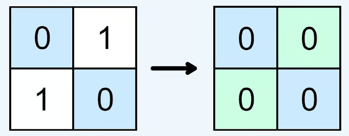
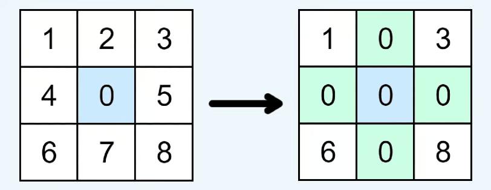

# Set Matrix Zeroes

Given an `m x n` matrix of integers `matrix`, if an element is `0`, set its entire row and column to `0`'s.

You must update the matrix *in-place*.

**Follow up:** Could you solve it using `O(1)` space?

## Example 1:



```ts
Input: matrix = [
  [0,1],
  [1,1]
]

Output: [
  [0,0],
  [0,1]
]
```

## Example 2:



```ts
Input: matrix = [
  [1,2,3],
  [4,0,5],
  [6,7,8]
]

Output: [
  [1,0,3],
  [0,0,0],
  [6,0,8]
]
```

## Example 3:


```ts
Input: matrix = [
  [1,1,1],
  [1,0,1],
  [1,1,1]
]

Output: [
  [1,0,1],
  [0,0,0],
  [1,0,1]
]
```

## Example 4:


```ts
Input: matrix = [
  [0,1,2,0],
  [3,4,5,2],
  [1,3,1,5]
]

Output: [
  [0,0,0,0],
  [0,4,5,0],
  [0,3,1,0]
]
```

## Constrains

-  `1 <= matrix.length, matrix[0].length <= 100`
-  `-2^31 <= matrix[i][j] <= (2^31) - 1`

## Retention Tracking

- [x] retained 20.02.25
- [x] retained 09.03.25